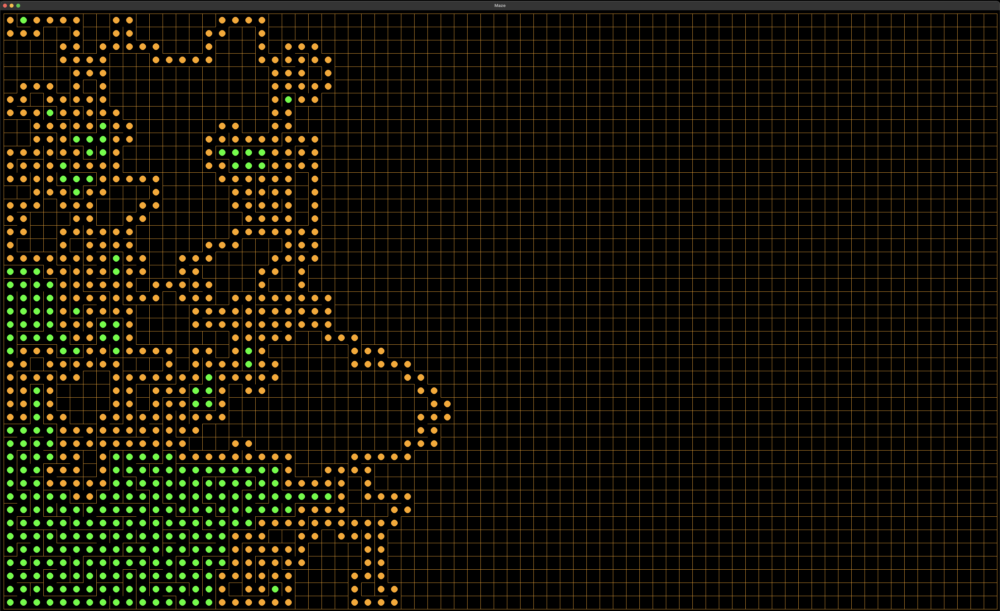
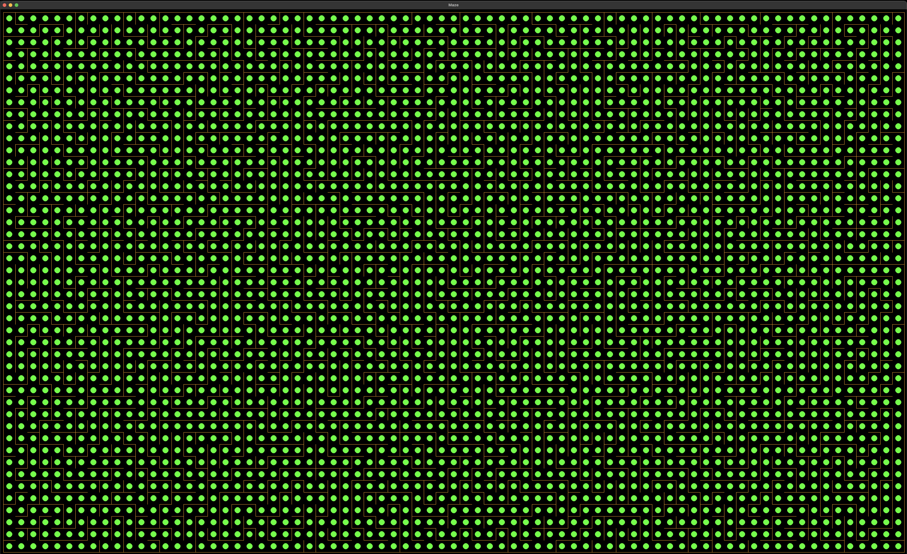
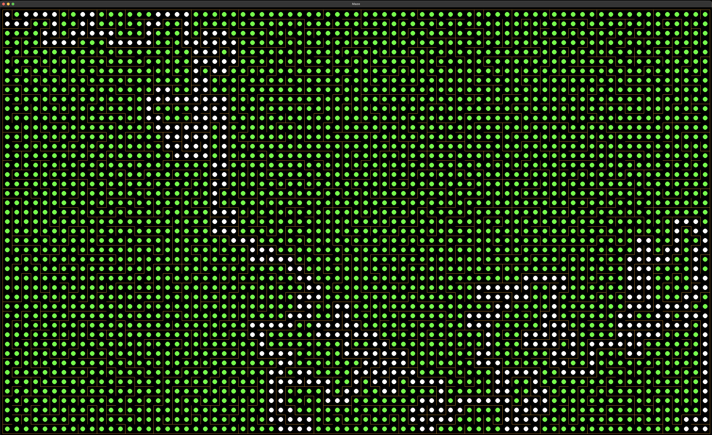
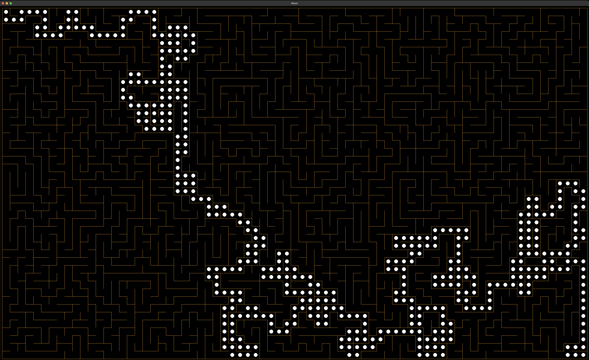
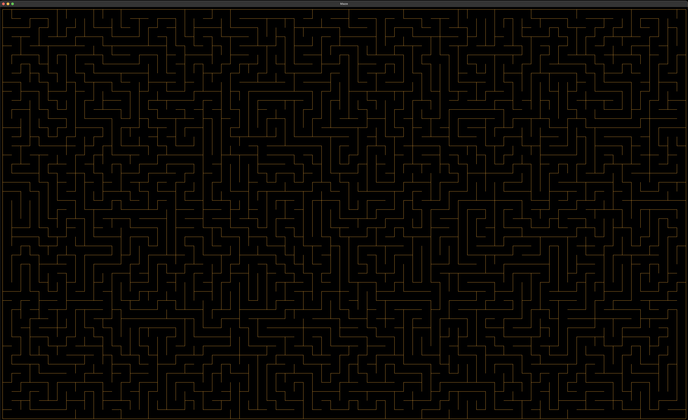
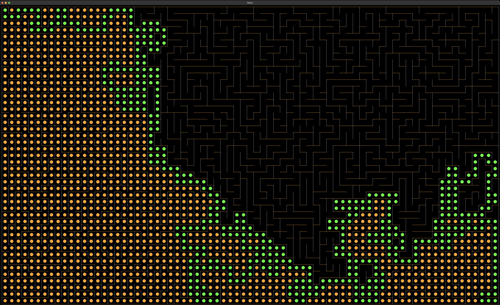
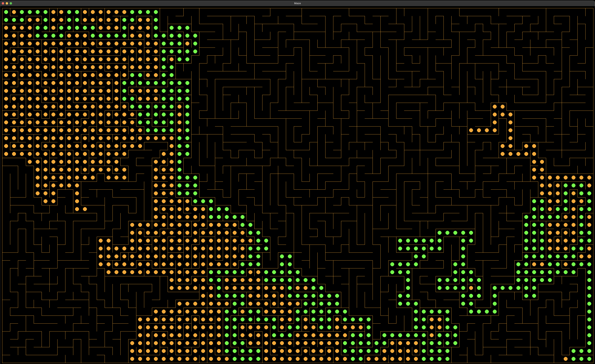
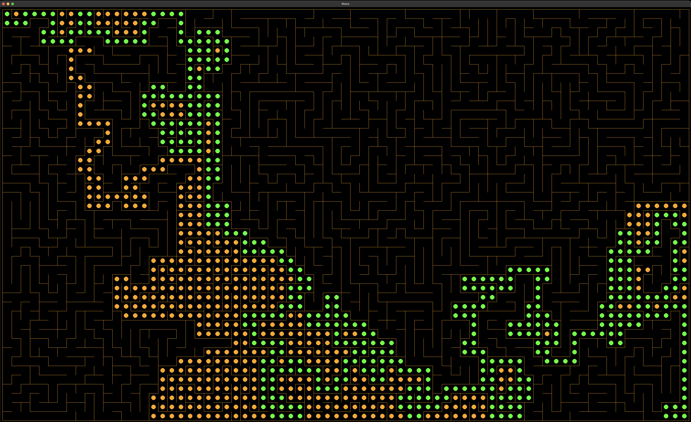

## maze
The project uses pygame library to visualize the process of generating and solving a maze.

### Controls
There is no proper GUI.

ENTER - Show/hide the shortest path.

SPACE BAR - Show/hide visualization when generating or solving a maze.

ESC - Hide the shortest path and generating/solving visualization.

G - Generate a new maze.

1 - Use DFS algorithm to solve a maze.

2 - Use BSF algorithm to solve a maze.

3 - Use A* algorithm to solve a maze.


### Generating a maze
Generates a maze using randomized Depth First Search algorithm.
Number of columns and rows, and the size of a block can be set in game.py:
```
GRID_COLUMNS, GRID_ROWS = 30, 20
BLOCK_SIZE = 40
```
#### Process of generating a maze
1. Look for not visited neighbours of the current block.
2. Randomly choose a neighbour from the available ones if possible.
3. If you found a neighbour:

   a) Add the current block to the stack.
   
   b) Remove walls between the current block and the selected neighbour.
   
   c) Make the neighbour the current block and mark it as visited.
4. If the current block doesn't have any not visited neighbours you need to backtrack:
   
   a) Mark the current block as revisited.

   b) Remove a block from the stuck and make it the current block.
5. If the current block doesn't have any not visited neighbours and the stack is empty you have reached
the first block and visited and revisited every block. The maze has been generated. Stop iterating.
6. Continue with next iteration.

#### Preview
A maze generation in progress.

Orange dot - the block has been visited and walls has been removed to create a path.

Green dot - the block has been revisited. There was no new neighbours and there was need to backtrack.


A maze has been generated. Every block has been visited and revisited.


The shortest path is shown.


Only the shortest path is shown.


A cleaned up maze.


### Solving a maze
A maze can be solved using one of three algorithms.

Orange dot - the block has been visited during algorithm iteration.

Green dot - the block has been visited during algorithm iteration and is the part of the shortest path.

#### Depth First Search Algorithm
1. Remove an element from the stack.
2. Mark the current block as visited.
3. Check if the current block is the goal block. Stop iterating if it is.
4. Look for valid neighbours.
5. For every neighbour found check if it has already been discovered (by checking predecessors)
    and if it hasn't been discovered yet:
    
    a) Push that neighbour to the stack.

    b) Add that neighbour to the predecessors dictionary to know it has been discovered and to store information about block that discovered it.
6. Continue with next iteration.


The maze was solved by DFS in 1766 steps.

#### Breadth First Search Algorithm
1. Dequeue an element from the queue.
2. Mark the current block as visited.
3. Check if the current block is the goal block. Stop iterating if it is.
4. Look for valid neighbours.
5. For every neighbour found check if it has already been discovered (by checking predecessors)
    and if it hasn't been discovered yet:
    
    a) Enqueue that neighbour to the queue.

    b) Add that neighbour to the predecessors dictionary to know it has been discovered
        and to store information about block that discovered it.
6. Continue with next iteration.


The maze was solved by BFS in 1265 steps.


#### A* Algorithm
1. Get an element from the priority queue.
2. Mark the current block as visited.
3. Check if the current block is the goal block. Stop iterating if it is.
4. Look for valid neighbours.
5. For every neighbour found check if it has already been discovered (by checking predecessors)
    and if it hasn't been discovered yet:
    
    a) Calculate g value which indicates the steps needed to reach the starting block from that neighbour
        and store it.
    
    b) Calculate h value which indicates the distance between that neighbour and the goal block
        using Manhattan Distance.
    
    c) Calculate f value which indicates priority value.
    
    d) Put that neighbour with calculated f value to the priority queue.
    
    e) Add that neighbour to the predecessors dictionary to know it has been discovered
        and to store information about block that discovered it.
6. Continue with next iteration.


The maze was solved by A* in 937 steps.

### Installation

1. **Clone the Repository:**
    ```bash
    git clone https://github.com/rafald1/maze.git
    cd maze
    ```
2. **Create a Virtual Environment:**
    ```bash
    python -m venv .venv
    ```
3. **Activate the Virtual Enviroment:**

    On Windows
    ```bash
    .\.venv\Scripts\activate
    ```    
    On macOS/Linux
    ```bash
    source .venv/bin/activate
    ```    
4. **Install Dependencies:**
    ```bash
    pip install -r requirements.txt
    ```
5. **Run the Application:**
    ```bash
    python main.py
    ```
